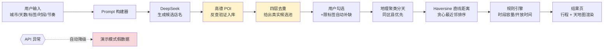

# AI 旅行规划助手

面向个人出游的 AI 旅行规划工具：输入「城市 + 天数 + 兴趣标签 + 时段 + 节奏」，自动生成按天分区、顺路、开放时间合规的行程和电子地图。核心特点是**防幻觉**——候选景点一律经高德 POI 反查验证入库，大模型仅做推荐与排版，无权新增地点。

## 功能特性

- **真实景点候选池**：按兴趣标签（自然风光 / 人文古迹 / 网红打卡地 / 手工DIY / 二次元）筛选，候选 100% 经高德 POI 反查验证，杜绝编造景点
- **防绕路路线**：地理聚类分天 + Haversine 直线距离贪心最近邻排序，减少折返
- **开放时间合规**：按所选时段过滤景点的开放时间
- **多图层地图**：天地图矢量 + 注记双层底图，按天分色标记，当日高亮、非当日减淡
- **异常降级**：API 异常自动降级到演示模式，不把报错抛给用户
- **质量验证**：内置回归实验（相似度阈值、去重、路线排序），驱动机制迭代

## 技术栈

Python · Streamlit · DeepSeek API · 高德地图 API · folium · 天地图

## 架构与数据流



> 防幻觉关键：候选 POI **一律先由大模型生成店名，再经高德反查验证入库**才进入候选池；排序与时段由规则算法完成，大模型在最终环节仅做排版，无权新增地点。

## 快速开始

> 需要自行申请三个 API Key：高德 Web 服务 Key、DeepSeek API Key、天地图浏览器端 Key。

1. 安装依赖

   ```bash
   pip install -r requirements.txt
   ```

2. 配置密钥

   复制项目根目录下的 `.env.example` 为 `.env`，填入你的 Key：

   ```ini
   AMAP_KEY=你的高德key
   TIANDITU_KEY=你的天地图key
   DEEPSEEK_KEY=你的DeepSeek key
   DEEPSEEK_BASE_URL=https://api.deepseek.com
   ```

   > `.env` 已被 `.gitignore` 忽略，密钥不会进入版本库。

3. 启动

   ```bash
   streamlit run app.py
   ```

   浏览器打开 `http://localhost:8501`。

## 目录结构

```
travel-planner/
├── app.py                 # Streamlit 入口
├── _config/               # 配置：Key、常量、日志
├── poi_pipeline/          # POI 管线（高德反查、LLM 推荐、四层去重）
├── selection/             # 候选筛选与自动补缺
├── routing/               # 地理聚类分天 + 贪心排序
├── rules/                 # 规则引擎（时段容量、开放时间、移动距离）
├── render/                # 行程渲染
├── map_view/              # 天地图底图 + 标记
├── ui/                    # 输入页 / 候选选择页 / 结果页
└── fallback/              # API 降级演示模式
```

## 注意事项

- 详细部署与 Key 申请、故障排查见 [`docs/DEPLOY.md`](docs/DEPLOY.md)。
- MIT License，见 [LICENSE](LICENSE)。

## 免责声明

本项目为学习与演示用途。API Key 需自行向各服务方申请并遵守其使用条款与配额限制。